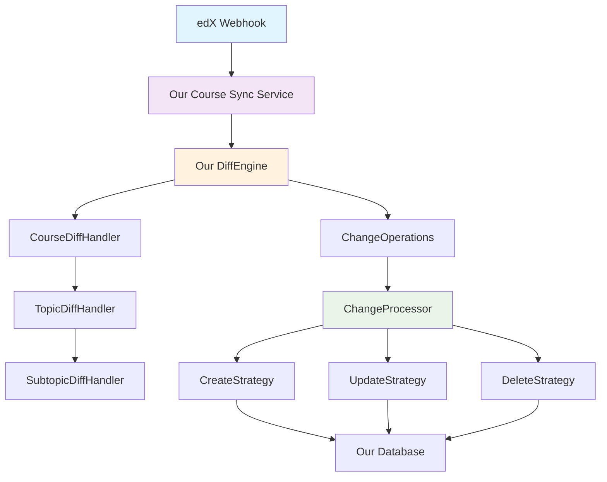
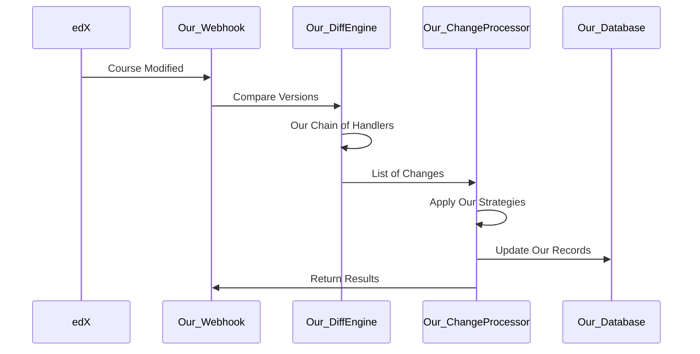

# Our Course Sync System: Design Patterns in Action

*How we built a maintainable course synchronization service at Virtu Educate*

## Our Mission

At Virtu Educate, we're on a mission to revolutionize education in Africa, starting right here in Malawi. Our vision is bold but clear: eliminate inequality in education through technology and provide high-quality education to all our students, regardless of their economic background or geographic location.

As part of our multi-tier strategy, we leverage open source software wherever possible. This led us to adopt Open edX as our course authoring tool - a proven platform that allows our educators to create rich, interactive course content.

## Our Technical Challenge

Using Open edX presented us with a significant synchronization challenge. When our course authors create or modify courses in edX, those changes need to efficiently sync with our custom services that handle student progress, assessments, and content delivery.

We considered several approaches:

**Change Data Capture (CDC)**: Listen to database changes and update our downstream services. While powerful, CDC introduces complexity around replication lag, schema dependencies, and requires deep database integration - overhead that doesn't benefit our lean team.

**Polling**: Regularly check for changes. Simple but inefficient, creates unnecessary load on our systems, and has latency issues.

**Webhooks**: Event-driven approach where edX notifies our system when changes occur. Clean separation of concerns, real-time updates, and aligns with our microservices architecture.

Given that we're a lean operation with a single engineer driving our technical vision, the webhook approach offered us the best balance of simplicity and effectiveness.

## Our Design Challenge

Even with webhooks handling the trigger mechanism, building a robust sync service presented us with complex challenges:

- How do we detect what specifically changed between course versions?
- How do we handle different types of operations (create, update, delete) with different business logic?
- How do we process various entity types (courses, topics, subtopics) that have different relationships and validation rules?
- How do we ensure our system can grow as we add new entity types?
- How do we maintain data consistency and handle failures gracefully?

This is where design patterns became invaluable for our solo engineer - they provide proven solutions to complex architectural problems.

## Our Solution Architecture

Our system uses three complementary design patterns:



### 1. Chain of Responsibility: Our Change Detection

Our DiffEngine uses a chain of handlers to detect changes at different levels:

```python
class DiffEngine:
    def _create_handler_chain(self):
        course_handler = CourseDiffHandler()
        topic_handler = TopicDiffHandler()
        subtopic_handler = SubtopicDiffHandler()
        
        # Our chain: Course → Topic → Subtopic
        course_handler.set_next(topic_handler)
        topic_handler.set_next(subtopic_handler)
        
        return course_handler
```

Each handler focuses on one entity level in our system. Our course handler detects course-level changes (title, description), then passes control to our topic handler for topic changes, then to our subtopic handler. This keeps our logic organized and makes it easy for us to add new entity types.

### 2. Command Pattern: Our Change Operations

Instead of immediately executing changes, our system creates command objects:

```python
@dataclass
class ChangeOperation:
    operation: OperationType      # CREATE, UPDATE, DELETE
    entity_type: EntityType       # COURSE, TOPIC, SUBTOPIC  
    entity_id: str               # Unique identifier
    data: Optional[ChangeData]   # The actual change details
```

This enables us to queue operations, maintain comprehensive logging, implement error recovery, and provides us with a complete audit trail of our synchronization operations.

### 3. Strategy Pattern: Our Operation Processing

Different operations require different logic in our system:

```python
class ChangeProcessor:
    def __init__(self, course, examination_level, academic_class):
        self._strategies = {
            OperationType.CREATE: CreateStrategy(...),
            OperationType.UPDATE: UpdateStrategy(),
            OperationType.DELETE: DeleteStrategy(),
        }
    
    def process_changes(self, changes):
        for change in changes:
            strategy = self._strategies.get(change.operation)
            strategy.process(change)
```

Each strategy handles the specific business logic, validation, and error handling for its operation type in our application.

## Our Implementation Flow



## Our Results and Impact

This pattern-based approach solved several critical problems for our resource-constrained team:

**Maintainability**: Each component in our system has a single responsibility. When we're debugging sync issues, we know exactly where to look - our strategy classes for operation logic, our handler classes for detection logic.

**Extensibility**: Adding new entity types to our platform (like assignments or quizzes) requires minimal changes to our existing codebase. We add new strategy classes, a new handler in our chain, update our data types. Our existing code remains untouched.

**Error Resilience**: Failed operations in our system don't cascade. If our topic creation fails, our subtopic updates can still proceed. All failures are logged with detailed context for our debugging.

**Solo Developer Productivity**: Clear separation of concerns means we can focus on one aspect at a time. Mock interfaces make our testing straightforward. New features follow our established patterns.

**Operational Visibility**: Comprehensive logging from each pattern component enables us to rapidly debug issues across our distributed system.

## Our Real-World Success Story

When we needed to add assessment synchronization to our platform:
- **Our implementation time**: 4 hours instead of our estimated 2-3 days
- **Our code changes**: We added new strategies and handler, zero modifications to our existing logic
- **Our testing approach**: Each component could be tested independently
- **Our deployment**: No risk to our existing synchronization functionality

Our pattern-based architecture proved its worth when our system needed to scale beyond the initial course-topic-subtopic model.

## Our Key Takeaways

For solo engineers and lean teams like ours working on complex integration challenges:

1. **Design patterns aren't over-engineering for us** - they're proven solutions that save us time in the long run
2. **Our architecture decisions have compounding effects** - good patterns make our future changes easier
3. **Separation of concerns enables us to maintain parallel mental models** - we can think about detection separately from processing
4. **Error handling becomes systematic for us** rather than ad-hoc when built into our pattern structure

Our Course Sync System continues to reliably handle synchronization as our platform grows, supporting our mission to democratize education across Africa.

---

*This case study demonstrates how our strategic application of design patterns helped our resource-constrained team build a robust, scalable system that supports our meaningful social impact mission.*