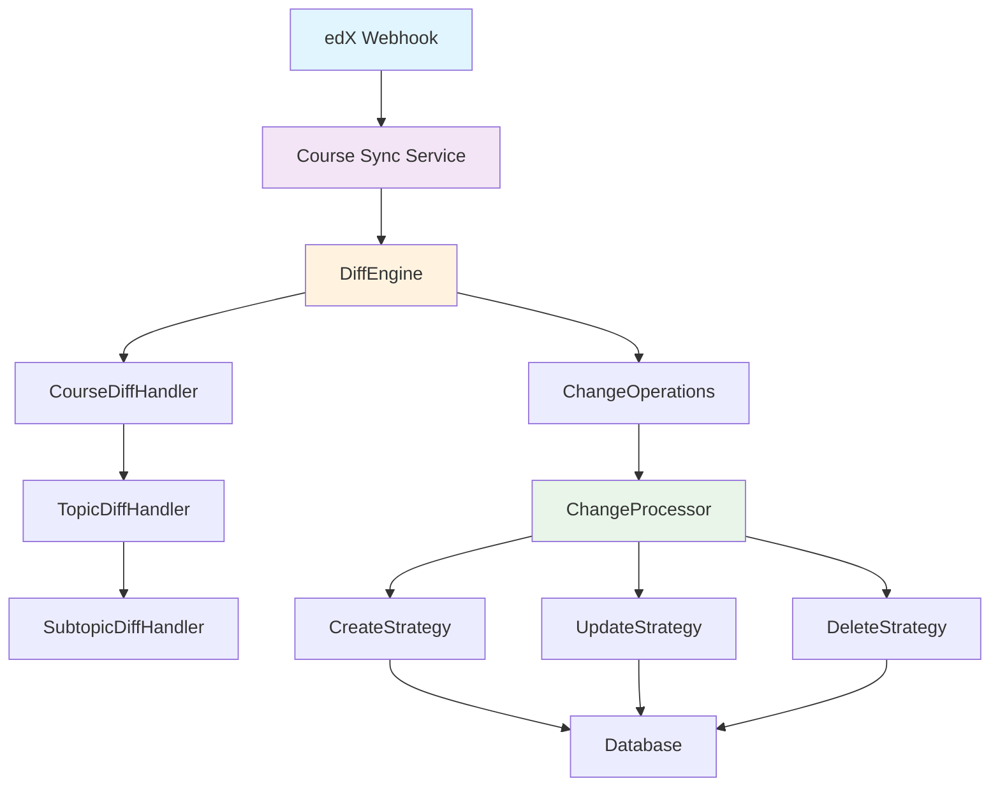
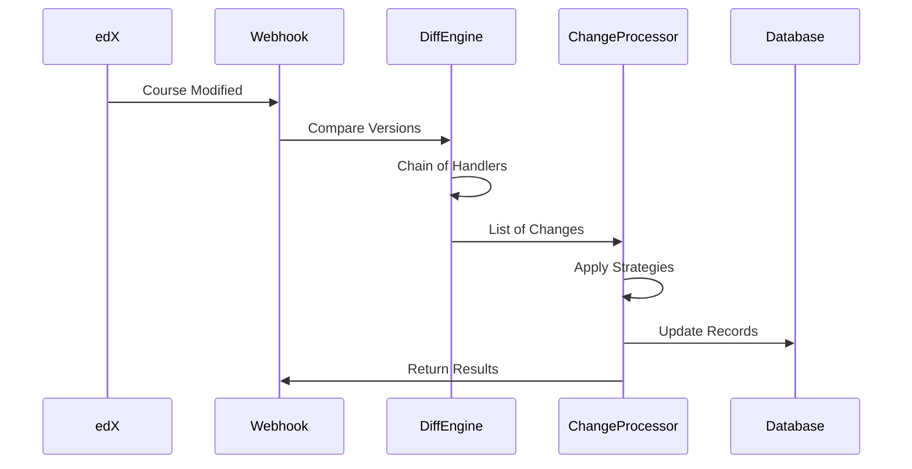

# Course Sync System: Design Patterns in Action

*How Virtu Educate built a maintainable course synchronization service*

## The Mission

Virtu Educate seeks to revolutionize education in Africa, starting with Malawi, by eliminating inequality in education through technology. Their vision is to provide high-quality education to all students, regardless of their economic background or geographic location.

As part of their multi-tier strategy, they leverage open source software wherever possible. This led them to adopt Open edX as their course authoring tool - a proven platform that allows educators to create rich, interactive course content.

## The Technical Challenge

Using Open edX presented a significant synchronization challenge. When course authors create or modify courses in edX, those changes need to efficiently sync with Virtu Educate's custom services that handle student progress, assessments, and content delivery.

Several approaches were considered:

**Change Data Capture (CDC)**: Listen to database changes and update downstream services. While powerful, CDC introduces complexity around replication lag, schema dependencies, and requires deep database integration - overhead that doesn't benefit a lean team.

**Polling**: Regularly check for changes. Simple but inefficient, creates unnecessary load, and has latency issues.

**Webhooks**: Event-driven approach where edX notifies the system when changes occur. Clean separation of concerns, real-time updates, and aligns with microservices architecture.

Given that this is a lean operation with a single engineer driving the technical vision, the webhook approach offered the best balance of simplicity and effectiveness.

## The Design Challenge

Even with webhooks handling the trigger mechanism, building a robust sync service presents its own complexity:

- How do you detect what specifically changed between course versions?
- How do you handle different types of operations (create, update, delete) with different business logic?
- How do you process various entity types (courses, topics, subtopics) that have different relationships and validation rules?
- How do you ensure the system can grow as new entity types are added?
- How do you maintain data consistency and handle failures gracefully?

This is where design patterns become invaluable for a solo engineer - they provide proven solutions to complex architectural problems.

## The Solution Architecture

The system uses three complementary design patterns:



### 1. Chain of Responsibility: Change Detection

The DiffEngine uses a chain of handlers to detect changes at different levels:

```python
class DiffEngine:
    def _create_handler_chain(self):
        course_handler = CourseDiffHandler()
        topic_handler = TopicDiffHandler()
        subtopic_handler = SubtopicDiffHandler()
        
        # Chain: Course → Topic → Subtopic
        course_handler.set_next(topic_handler)
        topic_handler.set_next(subtopic_handler)
        
        return course_handler
```

Each handler focuses on one entity level. Course handler detects course-level changes (title, description), then passes control to topic handler for topic changes, then to subtopic handler. This keeps the logic organized and makes it easy to add new entity types.

### 2. Command Pattern: Change Operations

Instead of immediately executing changes, the system creates command objects:

```python
@dataclass
class ChangeOperation:
    operation: OperationType      # CREATE, UPDATE, DELETE
    entity_type: EntityType       # COURSE, TOPIC, SUBTOPIC  
    entity_id: str               # Unique identifier
    data: Optional[ChangeData]   # The actual change details
```

This enables queuing, logging, error recovery, and provides a complete audit trail of synchronization operations.

### 3. Strategy Pattern: Operation Processing

Different operations require different logic:

```python
class ChangeProcessor:
    def __init__(self, course, examination_level, academic_class):
        self._strategies = {
            OperationType.CREATE: CreateStrategy(...),
            OperationType.UPDATE: UpdateStrategy(),
            OperationType.DELETE: DeleteStrategy(),
        }
    
    def process_changes(self, changes):
        for change in changes:
            strategy = self._strategies.get(change.operation)
            strategy.process(change)
```

Each strategy handles the specific business logic, validation, and error handling for its operation type.

## Implementation Flow



## The Impact

This pattern-based approach solved several critical problems for a resource-constrained team:

**Maintainability**: Each component has a single responsibility. When debugging sync issues, you know exactly where to look - strategy for operation logic, handler for detection logic.

**Extensibility**: Adding new entity types (like assignments or quizzes) requires minimal changes. New strategy classes, a new handler in the chain, updated data types. Existing code remains untouched.

**Error Resilience**: Failed operations don't cascade. If topic creation fails, subtopic updates can still proceed. All failures are logged with detailed context.

**Solo Developer Productivity**: Clear separation of concerns means you can focus on one aspect at a time. Mock interfaces make testing straightforward. New features follow established patterns.

**Operational Visibility**: Comprehensive logging from each pattern component enables rapid debugging across the distributed system.

## Real-World Results

When Virtu Educate needed to add assessment synchronization:
- **Time to implement**: 4 hours instead of estimated 2-3 days
- **Code changes**: Added new strategies and handler, zero modifications to existing logic
- **Testing**: Each component could be tested independently
- **Deployment**: No risk to existing synchronization functionality

The pattern-based architecture proved its worth when the system needed to scale beyond the initial course-topic-subtopic model.

## Key Takeaways

For solo engineers and lean teams working on complex integration challenges:

1. **Design patterns aren't over-engineering** - they're proven solutions that save time in the long run
2. **Architecture decisions have compounding effects** - good patterns make future changes easier
3. **Separation of concerns enables parallel mental models** - you can think about detection separately from processing
4. **Error handling becomes systematic** rather than ad-hoc when built into the pattern structure

The Course Sync System continues to reliably handle synchronization as Virtu Educate's platform grows, supporting their mission to democratize education across Africa.

---

*This case study demonstrates how strategic application of design patterns can help resource-constrained teams build robust, scalable systems that support meaningful social impact.*